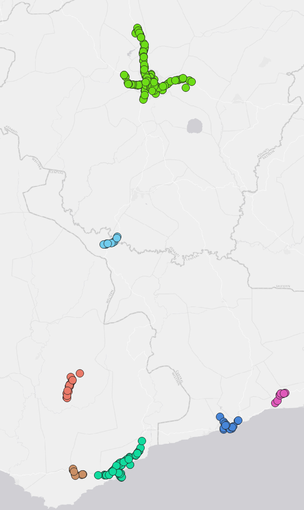

# Integrated Decision Units (IDUs) for Land Use Suitability Modeling

- [Integrated Decision Units (IDUs) for Land Use Suitability Modeling](#integrated-decision-units-idus-for-land-use-suitability-modeling)
  - [1. An integral part of Land Use Planning](#1-an-integral-part-of-land-use-planning)
    - [1.1 Some key concepts](#11-some-key-concepts)
    - [The meaning of a set of spatially explicit polygons to land use planning](#the-meaning-of-a-set-of-spatially-explicit-polygons-to-land-use-planning)
  - [Key Functions](#key-functions)
    - [1. DBSCAN clustering](#1-dbscan-clustering)
    - [1.1 Usage](#11-usage)
    - [1.2 Example](#12-example)
    - [2. Proximity](#2-proximity)
    - [2.1 Usage](#21-usage)
    - [2.2 Example](#22-example)
    - [3. Raster Calculator](#3-raster-calculator)
    - [3.1 Usage](#31-usage)
    - [3.2 Example](#32-example)
    - [4. Reclassify by Table](#4-reclassify-by-table)
    - [4.1 Usage](#41-usage)
    - [4.2 Example](#42-example)
    - [5. Eliminate selected polygons (Delete Holes)](#5-eliminate-selected-polygons-delete-holes)
    - [6. Subdivide](#6-subdivide)
    - [6.1 Usage](#61-usage)
    - [6.2 Example](#62-example)
  - [Assignment/Result](#assignmentresult)

## 1. An integral part of Land Use Planning

> "_**Land units**, or land-mapping units, are areas with and qualities that
> **differ sufficiently** from those of other land units to affect their
> suitability for different land uses._"

### 1.1 Some key concepts

- Land Unit: areas of land with specific characteristics (or qualities).
- Land Characteristic: simple attribute that can be measured or estimated. For
  example, _mean annual rainfall_.
- Land Quality: a complex attribute that usually reflects the interaction of
  many land characteristics, such as _susceptibility to flooding_.

Although any parcel of land can be considered a land unit, it is more efficient
and meaningful to use parcels that can be adequately described in terms of one
or a combination of land properties.
A land unit should therefore represent an area that is, in terms of
predetermined properties, different from the surrounding land and can be
assumed to have **homogeneous** land properties.

|  |
|:----:|
| _Source_: FAO. (1984). Land evaluation for development. |

Integrated Decision Units (IDUs) are a set of spatial containers, modeled as a
set of polygon-based Geographic Information System (GIS) coverages containing
spatially explicit depictions of landscape attributes and patterns.

IDUs are created based on information from multiple sources, such as parcel-level information, 
floodplain delineations, and soil permeability. By using vector-based GIS including intersection, 
expansion, grouping, etc., we can merge the information together to generate a layer of IDUs.

Since IDUs are created based on traits of a landscape, the area within an IDU is deemed homogeneous, 
so a single uniform decision can be made about that IDU without worrying about conflicts caused by heterogeneity.

### The meaning of a set of spatially explicit polygons to land use planning

IDUs essentially are a set of polygons with definite boundaries.
We assign a specific use for each IDU (based on suitability analysis). This assignment is simply referred to
as a land-use decision. 
Since land-use decisions are intrinsically discrete (two adjacent parcels can have different uses, for example), 
a vector (polygon) representation is more applicable than a raster representation. That's why we need to 
have a system of polygons, such as IDUs, to begin with. This is the first, however, 
critical step to achieving a spatially explicit land-use plan.

## Key Functions
### 1. DBSCAN clustering
For **Defined distance (DBSCAN)**, if the **Minimum Features per Cluster** can be found within the 
**Search Distance** from a particular point, that point will be marked as a core-point and included 
in a cluster, along with all points within the core-distance. A border-point is a point that is 
within the search distance of a core-point but does not itself have the minimum number of features 
within the search distance. Each resulting cluster is composed of core-points and border-points, 
where core-points tend to fall in the middle of the cluster and border-points fall on the exterior. 
If a point does not have the minimum number of features within the search distance and is not a 
within the search distance of another core-point (in other words, it is neither a core-point nor 
a border-point), it is marked as a noise point and not included in any cluster.

### 1.1 Usage
This tool is used to detect areas where points are concentrated and where they are separated by
areas that are empty or sparse. Points that are not part of a cluster are labeled as noise.
The results from running the DBSCAN algorithm help us identify points that make up a cluster
and points that are noise.

### 1.2 Example
As an example, we will use **DBSCAN clustering** to identify clusters of gas stations within
Ghana. The datasets used are listed below:

| ID | File Name       | Data Format | Type  | Description                     |
|----|-----------------|-------------|-------|---------------------------------|
| 1  | gas_station.shp | vector      | point | Gas station locations in Ghana  |

The two figures below display the parameter settings and the output of the tool.

| Parameter Settings       | Output      |
| ------------------------ | ----------- |
| | |

### 2. Proximity
The **Proximity** tool calculates the Euclidean distance from the center of the source cell 
to the center of each of the surrounding cells. Conceptually, the Euclidean algorithm works 
as follows: for each cell, the distance to each source cell is determined by calculating 
the hypotenuse with x_max and y_max as the other two legs of the triangle. This calculation
derives the true Euclidean distance, rather than the cell distance. The shortest distance 
to a source is determined, and if it is less than the specified maximum distance, the 
value is assigned to the cell location on the output raster.

### 2.1 Usage
This tool gives the measured Euclidean distance from every cell to the nearest source.
The distances are measured in the projection units of the raster, such as feet or meters,
and are measured from cell center to cell center.

>:pushpin: The projected units of a raster layer can be found under the _information_ tab
> in the layer properties

### 2.2 Example
Now we will use the **Proximity** tool in order to determine the Euclidean distance from 
a gas station cluster to the rest of the raster cells.

| ID | File Name      | Data Format | Description                |
|----|----------------|-------------|----------------------------|
| 1  | r_cluster1.tif | raster      | Cluster 1 in raster format |

The two figures below illustrate the parameters and output of the **Proximity** tool.

| Parameter Settings       | Output      |
| ------------------------ | ----------- |
| | |

### 3. Raster Calculator
The **Raster calculator** tool allows you to create and execute a Map Algebra expression
that will output a raster. We will be using a distance decay model in order to assign
weights to each cluster. Distance decay, also known as the Gravity Model or the 
Inverse Square Law, is the tendency of a spatial relationship between one place and 
another to weaken as the distance between them increases.

### 3.1 Usage
The **Raster calculator** tool is used to individually weight and multiply proximity 
rasters together.
- The weighting formula that we will use is: 1/W*Cluster
- W = # of points in a cluster / # of total points

### 3.2 Example

| ID | File Name            | Data Format | Description                       |
|----|----------------------|-------------|-----------------------------------|
| 1  | cluster1_euc_dst.tif | raster      | Euclidean distance from cluster 1 |
| 2  | cluster2_euc_dst.tif | raster      | Euclidean distance from cluster 2 |

The figures below show the parameters and output of the **Raster calculator** tool.

| Parameter Settings       | Output      |
| ------------------------ | ----------- |
| | |

### 4. Reclassify by Table 
**Reclassify by table** is a tool that reclassifies a raster band by assigning new class values based on
ranges specified in a fixed table.

### 4.1 Usage
This tool is used to reclassify raster values. 

### 4.2 Example

| ID | File Name              | Data Format | Description                                            |
|----|------------------------|-------------|--------------------------------------------------------|
| 1  | euc_cluster_output.tif | raster      | Result of adding together the weighted clusters 1 and 2|

The figures below show the parameters and output for the **Reclassify by table** tool.

> :pushpin: Check the details of an image:  
> If you can't see the image clearly, click on the image to view it in a
> new page, which will show the image in its original size.

| Parameter Settings       | Table parameters      | Output|
| ------------------------ | ----------- |--------|
|  | ||

### 5. Eliminate selected polygons (Delete Holes)

### 6. Subdivide 
is a tool that subdivides the original geometry into smaller parts, where no part has more
than the specified maximum number of nodes. 

### 6.1 Usage
The **subdivide** tool is used to break down complex geometries into more manageable parts.

### 6.2 Example

| ID | File Name      | Data Format |Type    | Description                     |
|----|----------------|-------------|--------|---------------------------------|
| 1  | study_area.shp | vector      |polygon | Geographic area to be subdivided|

## Assignment/Result
Create IDU for a different district based on the process detailed above